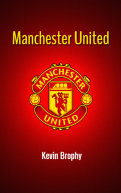

# Manchester United <kbd>v3.2.1</kbd>

  

## Creator
Kevin Brophy

## Description
The stadium is quiet. Nearly fifty thousand fans of the Manchester United team are silent. They have come to Barcelona with their favorite team to support them. So far, Bayern wins, but the gap is quite small. The players are tired. They are demoralized and not sure that they can win. Finally, some more active activities start on the field. And Manchester United scores one goal. It happens at the very end of the game, at the last minute of the match. The fans cheer up. After all, now their team has a chance. But there is less than a minute before the end of the match. Now it is completely incomprehensible how it will end. And the miracle happens. Another goal from Manchester United. They win the match in the final seconds. It was May of 1999. 
