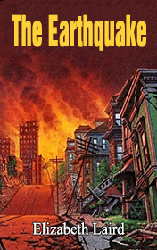

# The Earthquake <kbd>v3.2.1</kbd>

  

## Creator
Laird Elizabeth

## Description
This book is written by the modern author form New Zealand. She used to be a teacher and taught in many countries. Now she creates the touching stories for young people. Her books are translated into many languages. This work is about love difficult times. When a catastrophe happens, people first try to find their relatives or friends under the wrecks of the collapsed life. You will find a classic love triangle in the book. Sylvia is a young woman. She takes care of her ill mother. The family used to be rich, but everything changed after father's death. Gabriel is a young man, who is very kind and generous. He is Sylvia's old friend and he loves her. However, Sylvia loves Marco. Marco is a reach person. He is interested only in his fortune. A great earthquake happens on one Saturday evening. The tragedy completely changes their lives.
