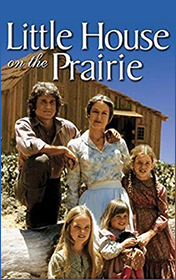

# Little House on the Prairie <kbd>v3.2.1</kbd>

  

## Creator
Laura Ingalls Wilder

## Description
A family of a father, a mother, Mary, Laura, and Carrie decided to leave their small home in Wisconsin and leave the country. They did this and never saw their home lost in the trees again. They decided to go to India. The father said that he wanted to live in a country with many wild animals where they would be able live in peace. They managed to obtain a new home. The mother was not sure of this decision, as their previous house was very warm and cozy. She did not want to abandon it. But they decided to leave until the ice on the Mississippi River melted; later they could not have passed there. The road was long and hard. They tried to go as much as possible every day. Once the family sold the horses and bought some new ones. The girls chose names for them.
