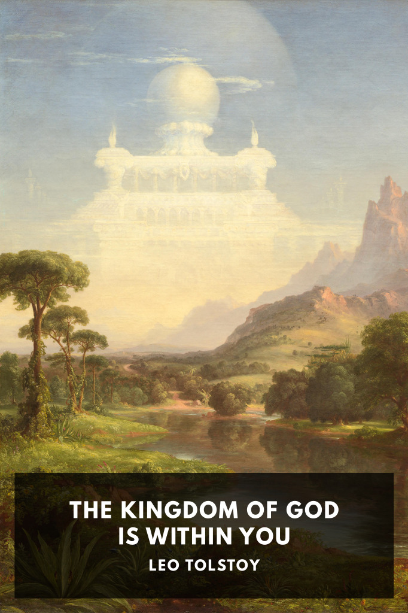

# The Kingdom of God Is Within You <kbd>v3.2.1</kbd>

  

## Creator
Leo Tolstoy

## Description
Tolstoy describes true Christianity as a non-hierarchical, nonviolent, non-coercive pursuit, and criticizes institutional Christianity as a deceptive corruption.
