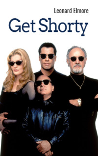

# Get Shorty <kbd>v3.3.1</kbd>

  

## Creator
Leonard Elmore

## Description
Chili Palmer is a gangster who lives in Miami. Once he gets valuable advice from an old friend - he learns how one can easily get a lot of money. So Chili goes to a horror movie producer named Harry. After all, what could be easier than knocking money out of a debtor? But all of a sudden he makes friends with Harry. And then the gangster remembers his childhood dream. He wanted to make his own horror movie. Chili realises that the perfect moment for this has come. Together they decide to write an exciting plot based on the experience of Chili. The real gangster has overcome many scary things. Harry agrees to start this project as he simply has no other choice. But man proposes, God disposes. The next movie is to turn into a bunch of problems. 
