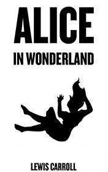

# Alice in Wonderland <kbd>v3.2.1</kbd>

  

## Creator
Lewis Carroll

## Description
The world-famous fairy tale was written by an English writer and mathematician in 1865. This book is one of the best examples of nonsense literature. In the fairy tale, the reader can see dozens of complicated philosophical, mathematical and linguistic jokes. In this story, we can find many interesting hidden meanings. The girl Alice spends her time on the river bank. She is bored. Suddenly she sees a strange white rabbit. The small animal has a big pocket watch in his paws and he is in a hurry. Alice follows the rabbit and falls into a hole. The curious girl finds herself in a phantasmagoric world inhabited by many anthropomorphic creatures. And this is only the beginning of her unusual, strange and surprising adventures.
