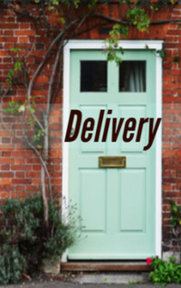

# Delivery <kbd>v3.3.1</kbd>

  

## Creator
Lorcan Byrne

## Description
Mrs. Kennedy is sitting at the table and making entries in her diary. She is in a cozy country house, but she does not feel this comfort. A box of products appears at the door every week, but the woman does not open the door. A year has passed since the accident. Charlie delivered food. After he delivered food to Mrs. Kennedy, he could leave the car for the night and use it on his own. He usually drove home to his mother at the wheel of a bright yellow van. They would have dinner together, and then the guy could take the mother to the city. Charlie's mother was sure that the owner of the grocery store was a good person. After all, he allowed her son to take a van for the whole night - and Charlie would drive his mother to a card game. That evening, Charlie was carrying another box of products. The weather was bad. It started raining.
