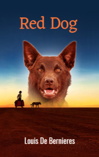

# Red Dog <kbd>v3.2.1</kbd>

  

## Creator
Louis De Bernieres

## Description
This book is written on the basis of a real story that happened several decades ago. Everything happened in Australia. The protagonist of this story is an ordinary red dog, whose name is Blyui. This dog has become a real celebrity in the western part of the country. All the local residents love it. Blyui is very kind and incredibly smart. Everyone greets the red dog with sincere joy. He can appear in any city and live there for several months among local residents. Blyui can simply jump out onto the road, stop the car and go on a trip. This way he has been travelling for a long time. Once the dog meets that one special person, to whom he becomes attached. So Blyui makes a firm decision to stay with him. 
