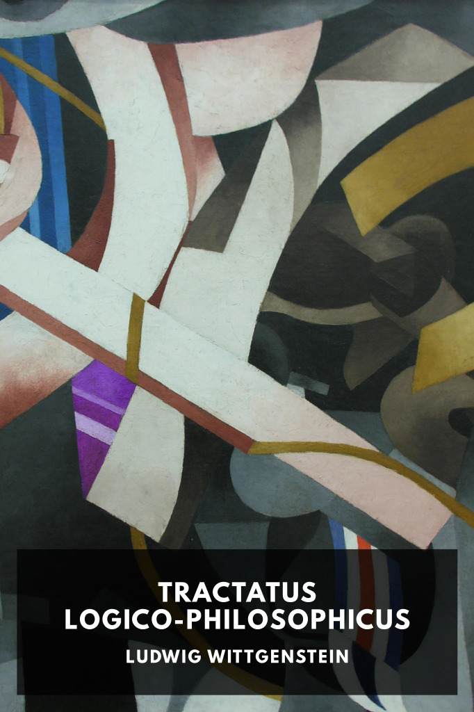

# Tractatus Logico-Philosophicus <kbd>v3.3.1</kbd>

  

## Creator
Ludwig Wittgenstein

## Description
One of the most important texts of 20th century philosophy, in which the nature of the philosphy, language, understanding, and logical atomism are explored.
