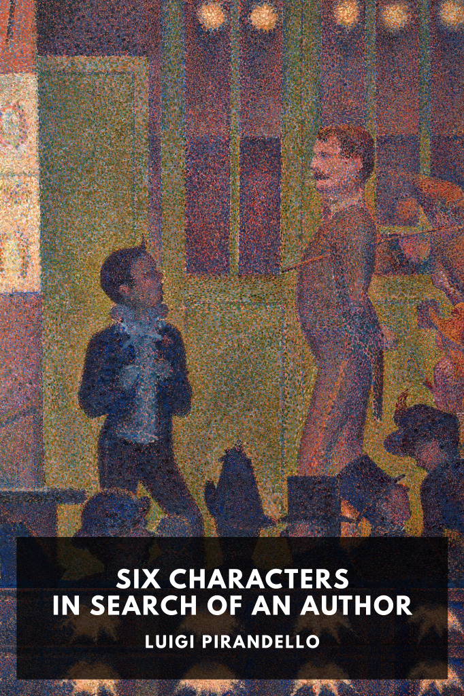

# Six Characters in Search of an Author <kbd>v3.3.1</kbd>

  

## Creator
Luigi Pirandello

## Description
An absurdist comedy that contrasts illusion with reality, in which six characters arrive on a rehearsal stage filled with actors and demand the chance to speak their lines and act out the story of their lives.
