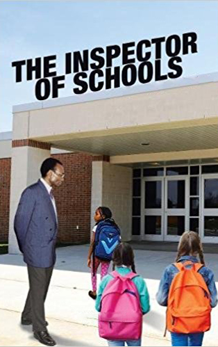

# The Inspector of Schools <kbd>v3.2.1</kbd>

  

## Creator
M. Athar Tahir

## Description
Every child has the right to education. He must have a big classroom where he can study. He must have good teachers and books. The government's duty is to take care of these necessary things. That is how it should be. But our world is not perfect and the inspector who checks schools knows about this. He arrived in this Pakistani village to check out the room and how the classes are being taught. He has to control the conditions and quality of the children's education. The Inspector has been holding this post for three years. He has been constantly travelling around the towns and villages of this region. Everywhere he faces the same problems: lack of books, lazy students, carefree people and teachers who work only for gifts and extra fees. But here he has one more difficult task. He cannot find the only school in this village. The Inspector wanders through the dirty streets and fields. The only local resident who he meets is also unable to help him.
