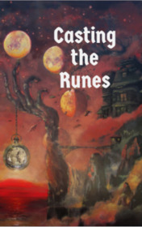

# Casting the Runes <kbd>v3.2.1</kbd>

  

## Creator
M. R. James

## Description
The storyline of the book takes place in the early twentieth century. The plot begins with a correspondence between two people. These are Mr. Karswell and Secretary Gayton. Mr. Karswell sends an article to the club. Mr. Karswell considers himself an alchemist. He is very rich - that's all people know about him. Most believe that this person either tells a lie, or believes in something that does not exist. And now Mr. Karswell wants to meet with the club secretary and discuss all questions personally. One day, the secretary dines with his wife and friends. One of the friends says that he had recently seen Mr. Karswell. He lives in the province and communicates very little with his neighbors. People think he is a strange man. No one knows what this man does in his free time.
