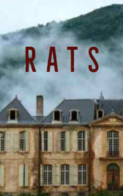

# Rats <kbd>v3.3.1</kbd>

  

## Creator
M. R. James

## Description
Everything happened in the city of Suffolk. The road went from the coast and climbed into the hills. A high mansion stood not far from the hill. It was built at the end of the eighteenth century. Behind the house there were other buildings and green gardens and in front of it there was a field of heather. Everybody could see the sea from it. Previously, this building was a popular hotel. And today it still accepts guests. Mr. Thomson came to this hotel. He was looking for a calm and pleasant environment to do his work. The man was the only guest, and the owner of the hotel and his wife kept the house clean. He was going to stay in the city for about a month: in the morning he would study, and in the evenings he would walk and communicate with the locals. During one of these walks, he saw something unusual.
