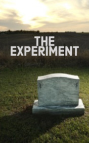

# The Experiment <kbd>v3.3.1</kbd>

  

## Creator
M. R. James

## Description
Mr. Hall was a priest from a small village. One day he was working in the office when his servant entered. The woman was alarmed. She said that the squire died. Mr. Hall was surprised, because he had seen this man the day before. But soon the church bell rang, notifying the village of someone's death. It was true. People said that the squire suddenly got some terrible unusual disease. He passed away very quickly and they decided to bury him as soon as possible. The priest took his clothes and left the office to learn all the details. As it turned out, the squire said he did not want to be buried in the family crypt. He wished to be buried in an ordinary grave in a cemetery. The priest thought that the man was too ill to realize what he was talking about. But the last desire must be fulfilled.
