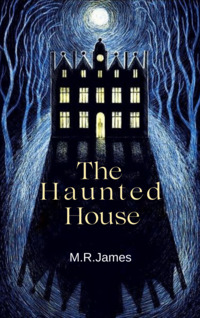

# The Haunted Doll's House <kbd>v3.2.1</kbd>

  

## Creator
M.R.James

## Description
Mr Dillet was looking at the doll's house in the shop window with pleasure. Finally he pointed to this interesting thing with his stick and asked the price. The owner of the store, Mr Chittenden, immediately began a prepared speech. He told that such an old doll's house should be in a museum. It was definitely very expensive. In the end the owner gave up and agreed to a low price. Mr Dillet was satisfied. He left the shop with the doll's house. And Mr Chittenden went to the back room where his wife was. He told her about this client and his purchase. The man spoke with relief in his voice. His wife was glad to hear that. And happy Mr Dillet did not know, how this accidental purchase would change his life.  
