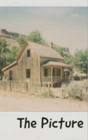

# The Picture <kbd>v3.3.1</kbd>

  

## Creator
M. R. James

## Description
Mr. Williams worked in the museum, which was located at the Oxford University. The man expanded the collection of monuments of the English culture of this institution: notes, drawings of churches and country houses. Mr. Williams thought that his work would be the most serene in his life, but even here he found unpleasant surprises. He found many good exhibits for the museum and sent the list to regular customers several times a year - in case some of them wanted to buy something. In response, he received letters with the numbers of photos. On that day, he received another message in which it was reported that he should carefully study one of the pictures. The author of the picture was unknown. It was an image of a country house with a rather high price.
