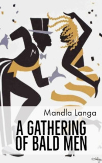

# A Gathering of Bald Men <kbd>v3.2.1</kbd>

  

## Creator
Mandla Langa

## Description
In the modern world people have a lot of worries that did not exist a hundred years ago. It can be a lack of money or a stupid annoying boss. The daughter dates some guy who is not good enough for her. The wife does not understand and does not want to make contact. At work situation is bad too. No one listens, even when there are good offers. Caleb lives that way. He is a little over forty. Caleb has two teenage daughters, a house and pets. But he is not very happy. The man sells insurance to customers, but they rarely want to pay. And he worries about the money owed to the bank. Recently he noticed that he started going bald. Caleb's uncle died and now he hopes to get an inheritance, which will help him a little in this financial situation.
