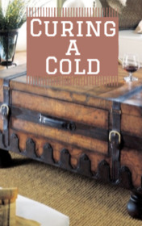

# Curing a Cold <kbd>v3.2.1</kbd>

  

## Creator
Mark Twain

## Description
When the White House in Virginia burned down - the main character of this book lost his home and his precious trunk, and also happiness. It was not a problem. A home without close people who take care of you is not a real home. Happiness is also not a problem. But the loss of the trunk was important, it was insulting for him. On the first day after the fire, he caught a cold and constantly sneezed. A friend told him to pour hot water into a basin and warm legs there. The next morning, the ill man had a cold shower and went to a restaurant to eat well. Another friend advised him to drink a bottle of warm salt water - this is the best cold medicine. This method was also useless. Now he suffered not only from a cold, but also from stomach ache. He would rather have survived an earthquake; this is better than drinking warm, salty water.
