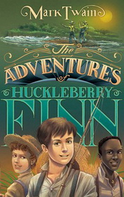

# Huckleberry Finn <kbd>v3.2.1</kbd>

  

## Creator
Mark Twain

## Description
The Adventures of Huckleberry Finn is the next part of the world-famous story about the fascinating adventures of smart guy Tom Sawyer. The novel was published in 1884. It is one of the first novels written in colloquial English with the usage of jargonisms. This story describes a lot of different small towns and nationalities living near the Mississippi river. The book is full of sarcasm and mockery of many prejudices of that time including racism. Mrs. Douglas adopts Huckleberry Finn. The adoptive mother is desperately trying to educate him and make more religious. The boy is bored and runs with Tom Sawyer to the gang of 'robbers'. Later the father kidnaps Huck. He manages to escape and starts his own raft  trip down the Mississippi.
