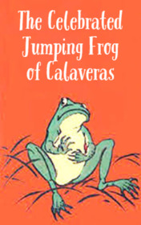

# The Celebrated Jumping Frog of Calaveras <kbd>v3.2.1</kbd>

  

## Creator
Mark Twain

## Description
Once the main character of this story received a letter from an old friend who lived in the East. He asked to visit one old man whose name was Mr. Wheeler. Simon Wheeler should have known something important that the friend wanted to learn. The young man decided to fulfill this request and went to the meeting. He saw the old man in the tavern. He was sleeping near the old stove. The young man woke Simon Wheeler up and started questioning about his childhood friend Leonidas. Simon readily told his story. It happened in 1849.  A man who called himself Jim Smiley came to their camp. He was very lucky and loved to bet on what was going to happen. He always guessed what would happen in the camp of the miners. He also easily predicted the results of the horse racing or dog fighting.
