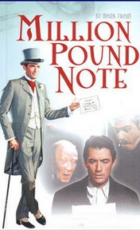

# The Million Pound Bank Note <kbd>v3.2.1</kbd>

  

## Creator
Mark Twain

## Description

An ordinary official worker suddenly appeared in foreign country only with one dollar in a pocket. When he spent his money at first day, he became an absolutely beggar. But his destiny wasn't to die from hunger. Two very rich brothers had an agreement: can someone live a month with one unique note of five million pounds or not? They proposed poor foreigner to take park at such experiment and to find out a truth. A hungry and tired man did not understand the proposal clearly, but when he heard word money - he agreed. He took an envelope with banknote and rushed to the nearest cafe. He ordered a lot of meal, but when he opened the envelope, he understand that he could not pay…

