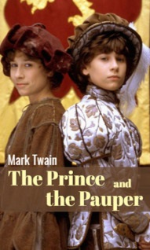

# The Prince and the Pauper <kbd>v3.2.1</kbd>

  

## Creator
Mark Twain

## Description
Someone wakes up in a slum and is glad to see a new day. Especially when your stepfather does not beat you. Someone is lying on a soft bed. Such destinies are so defferent. What can they have in common? Tom Canty is a poor boy. He is a beggar. But Tom likes reading and dreams to see the king. One day fate gives him such an opportunity. The boy sees Prince Edward VI through the palace fence. The prince even invites Tom to go inside. The two boys notice how similar they are. They change clothes for fun. This joke radically changes their lives. The guard thinks that the prince is a beggar. He drives him out of the palace. Tom is dressed as an heir. The servants are sure that he is the prince. Will they be able to survive in a new world? Will the prince and the pauper be able to change it back? 
