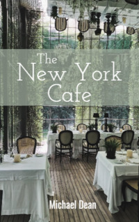

# The New York Cafe <kbd>v3.3.1</kbd>

  

## Creator
Michael Dean

## Description
'The New York Cafe' is a book written for English learners by Michael Dean. Everything happens in New York in the year 2030. What kind of future is it? There are new technologies, flying cars, high incredible buildings. People even make trips to Mars. But this future is not so great. There are also many poor and hungry people in the world. One day somebody will want to change everything. This person will have a wish to help humanity. But how will this person help? By what methods? There are good and bad ways. One day an e-mail comes to New York Cafe. It says, 'I want to help people and make them happy!' But this is not what everyone wants. The police and the president are very interested in this cafe now. 
