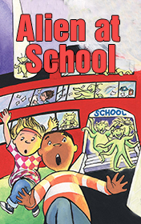

# Alien at School <kbd>v3.2.1</kbd>

  

## Creator
Michelle Brown

## Description

Jennifer Dale is sixteen years old American teenager who is 90dreaming about journalist career. She is excited about starting education at a high school. She and her friends dream about handsome and nice teachers, preferably men. They got some male, but their expectations weren't justified completely. Mr Stone is an teacher of English, his appearance very weird. He is cold, unemotional, has metallic voice like a robot. He shocked Jane and her friends at the very first day. Next day they noticed that he drinks strange liquid and takes black pills. His eyes changes their colour from time to time and he talks to sky during his walks outside! Guys have enough clues for considering that their teacher isn't a human. As says International Space Fan Club, constellation and a comet has met just a week ago in such way that there is a big possibility of alien's voyage on Earth.

