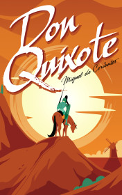

# Don Quixote <kbd>v3.2.1</kbd>

  

## Creator
Miguel De Cervantes

## Description

This is one of the most popular stories from the classical world literature which has a lot of interpretations in our days. The hero is Don Quixote de La Mancha who embodies the eternal human values. A knight-errant Don Quixote was born when the hidalgo Senor Alonso Quixano had read a lot of books about the knights' adventures. These stories captured his mind and have inspired him so much that the man has reincarnated. Everyone who met them thought that he is crazy. Because an ordinary man doesn't kill non-existent dragons, fight with windmills and wants to rescue fair maidens? If you want to be a knight and change the world, all what you need are a valiant war horse Rocinante, lonely princess which you dedicate your life and a brave squire to accompany you.

