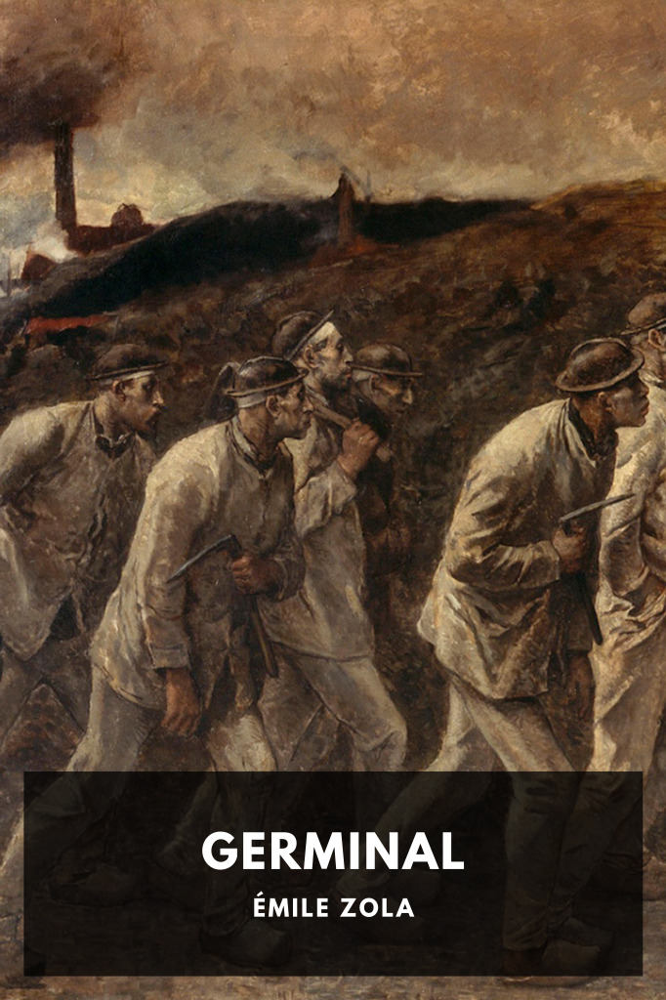

# Germinal <kbd>v3.2.1</kbd>

  

## Creator
Émile Zola

## Description
A new resident of a poor coal mining town in 1860s France begins learning about socialist principles, and convinces the town to go on strike.
