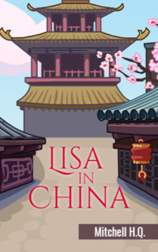

# Lisa in China <kbd>v3.3.1</kbd>

  

## Creator
Mitchell H.Q.

## Description
Lisa is invited to take part in the first International Photo Convention in China. The girl is excited about the trip. She flies to Beijing. There she meets Hu Tian and his sister Mei. They are her guides in China. Besides the convention, Lisa has many other adventures. The girl tries traditional Chinese food and learns to eat with chopsticks. She also visits many famous attractions such as Tiananmen Square, the Forbidden City, the Great Wall of China and the Terracotta Army. Lisa and her new friends travel to Shanghai to admire the nature and beautiful historical buildings. Later they visit Hong Kong where the girl tries practising Tai Chi. It is an ancient Chinese martial art. Lisa has an unforgettable experience in China. 
