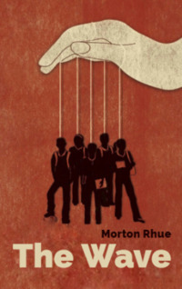

# The Wave <kbd>v3.2.1</kbd>

  

## Creator
Morton Rhue

## Description
This book is written on the basis of real events that happened in one Californean school in the late sixties. The experiment, called the Wave, changed the life of the upper classes. Everyone had been keeping these events in secret until one of the teachers admitted that it was one of the worst moments in his life. This novel shows how powerful public opinion can be and how it can affect the life of any ordinary person. After all, this public opinion was an important factor in many historical events and a way of manipulating in religious sects. It makes people think of how society can perceive them. How it can make a person act atypically, forget their interests, principles and much more. By opening this book you will learn more about a mysterious experiment that no one knew before.
