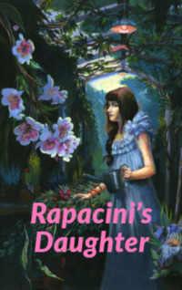

# Rapacini's Daughter <kbd>v3.3.1</kbd>

  

## Creator
Nathaniel Hawthorne

## Description
Giovanni left his home lot of years ago. He decided to ride to the north of the country for study. He rented a small cheap room on the third floor of the old house which was musty and dark. The house itself was large and beautiful as a real palace.  Previously, this house belonged to one ancient noble family. Today, there was only one old woman who earned a living by renting rooms to students. From a small dirty window in his room, Giovanni could see a large, beautiful garden in the courtyard. Once he asked an old woman if this garden belonged to her. But she replied that the owner of a garden was a famous man. His name was Rappaccini. He used plants from the garden in his research. This doctor lived in a small old brown house nearby.
