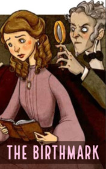

# The Birthmark <kbd>v3.3.1</kbd>

  

## Creator
Nathaniel Hawthorne

## Description
It was the end of the eighteenth century. One man of science lived in the world. One day he left his laboratory and met a young beautiful woman. Later she became his wife. Aylmer sincerely loved his spouse, but still science remained the main passion of the young man. One day, he looked at his wife and asked if she knew that he could remove the birthmark from her cheek. The wife said this birthmark only gave her a special charm. Aylmer kept standing on his own. He said the mole was very annoying. But these words only made his wife sad and the woman started crying. This mole looked like a small handprint. Her parents said that the fairy stroked her cheek in the childhood. Even after this Aylmer did not calm down. He became obsessed with the birthmark.
