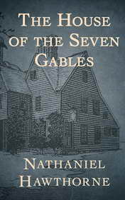

# The House of the Seven Gables <kbd>v3.2.1</kbd>

  

## Creator
Nathaniel Hawthorne

## Description
Once upon a time one man named Matthew Maule built a small hut. It happened in the town of New England. He was the first man to build a hut in that street. Later the street was named Maule's Lane. It was rumored Maule practiced magic. Practicing magic was a big crime in those times. Colonel Pyncheon also lived in that town. He had power and always got what he wanted. The biggest Pyncheon's desire was to owe wizard's hut. Maule did not agree to sell his house. The colonel decided to act in another way. Pyncheon accused the stubborn man of witchcraft and the community sentenced Maule to death. Maule's decease was awful. His curse was more terrible, which he pronounced in the last minutes of life. Colonel Pyncheon achieved his goal and built a house on the wizard's territory. It was the house of the Seven Gables.
