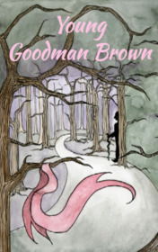

# Young Goodman Brown <kbd>v3.2.1</kbd>

  

## Creator
Nathaniel Hawthorne

## Description
At the end of the day, the young Goodman Brown went out into the streets of Salem Village. Then he returned to the house for a second, and his wife Vera kissed him. She desperately asked him to stay at home, but Goodman Brown answered, that he had to make this journey before dawn. Vera looked from the house and the wind started playing with her hair. The young man resolutely went down the road. When he looked back, he saw the figure of his spouse with the pink ribbons in her hair in the distance. The woman was standing on the threshold. Goodman was ashamed to make Vera sad. Still he kept going. It was getting dark and an Indian could be hiding behind every tree. But the man was going to meet his companion and he had to get there on time.
