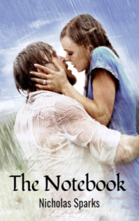

# The Notebook <kbd>v3.3.1</kbd>

  

## Creator
Nicholas Sparks

## Description
This book sold many copies and became a significant contribution to the treasures of world literature. There is also a movie made on this novel. It is time to read it. Noah is returning to his home in North Carolina from World War II. His father died and Noah starts restoring the house. At the same time, Allie sees a photograph of the house in the newspaper. She decides to visit Noah. They have not seen each other for fourteen years. Long ago, they had a short but passionate romance. And then a separation followed. Their meeting is very emotional. They have lots of news and everyone talks about his or her life. Allie finds out that Noah has been writing letters to her all this time. But her mother hides all of them. At the same time, fiance of Allie is trying to contact her. This turns into a love triangle. 
