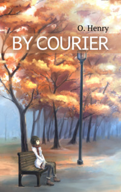

# By Courier <kbd>v3.3.1</kbd>

  

## Creator
O. Henry

## Description
At that time of year there were few people in the park. A young girl was sitting on one of the benches. Perhaps she just wanted to rest and think about the coming spring. But there was sadness on her beautiful face. Her lips were compressed into a thin line. A tall young man walked past the bench where this girl was sitting. A boy with a suitcase was coming behind him. The man saw the girl. Suddenly his face changed to red. Then he became pale again. The girl pretended not to recognise him. The man sat down on a nearby bench, fifty meters from her. He stopped the boy and asked him to send a message to the lady on the next bench. So the boy became a random courier. A courier, who can change the fate of two people.  
