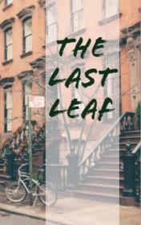

# The Last Leaf <kbd>v3.2.1</kbd>

  

## Creator
O. Henry

## Description
New York consists of numerous districts. In one of such districts there are small streets called 'places'. Lots of artists discovered these places and decided to live there. Cheap rentals and old lofts were the things they liked. Later this place was named Greenwich Village. Sue and Johnsy opened a studio on the top floor of one old building. The real name of Johnsy was Joana. She came from California. Sue was from Maine. Soon they became best friends. Suddenly a dangerous disease came to their house. Sue got pneumonia. The doctor examined her. He said that the girl had only one way to survive - she had to obtain a passion to life. She needed either a beloved person or a life goal. Johnsy decided to help her friend recover.
