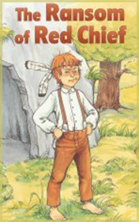

# The Ransom of Red Chief <kbd>v3.3.1</kbd>

  

## Creator
O. Henry

## Description
Everything happened in Alabama. Bill Driscoll and Old Hank thought they needed more money. They decided to kidnap a child.  People in small towns love their children very much. In such places you can find lazy fat sheriffs who do not like investigating crimes. They found a boy in one of the courtyards. First thing the child threw a stone in the Bill's eye. With great difficulty, they managed to grab the boy, even though he fought like a bear. The child was taken to a cave, not far from the town. There was already a small supply of food. When Bill returned to the cave, he saw a fire in front of it and the boy with feathers in his hair. Old Hank said they were playing Indians. And that was just the beginning. Bill realized that this child could cause more problems than any adult.
