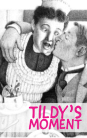

# Tildy's Moment <kbd>v3.3.1</kbd>

  

## Creator
O. Henry

## Description
A small family restaurant is not the most famous or posh place in the city. Most clients are people who need an inexpensive but tasty food. Large portions for hungry men. The restaurant owner personally works in the hall and accepts money from guests. There are also two waitresses working there: a tall and beautiful woman and a low, fat partner who looks like a gnome. Mostly men visit the restaurant. Certainly, they love the tall beautiful girl more. They enjoy talking to her and just watching. She is able to support any conversation and to be pleasant and sweet. The young girl often receives expensive gifts from the customers. Nobody pays attention to the short fat waitress. Men do not want to talk to her and, of course, do not give gifts. She is just a good waitress, but that is not enough.
