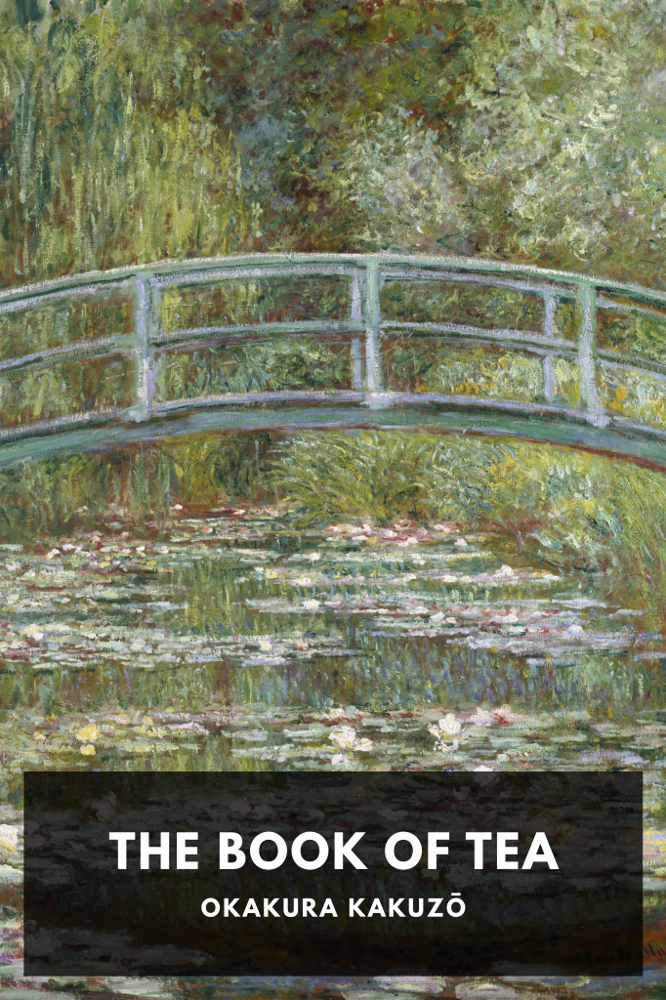

# The Book of Tea <kbd>v3.3.1</kbd>

  

## Creator
Okakura Kakuzō

## Description
The Book of Tea is a long essay exploring the relationship between teaism, taoism, and the aesthetics of Japanese culture.
