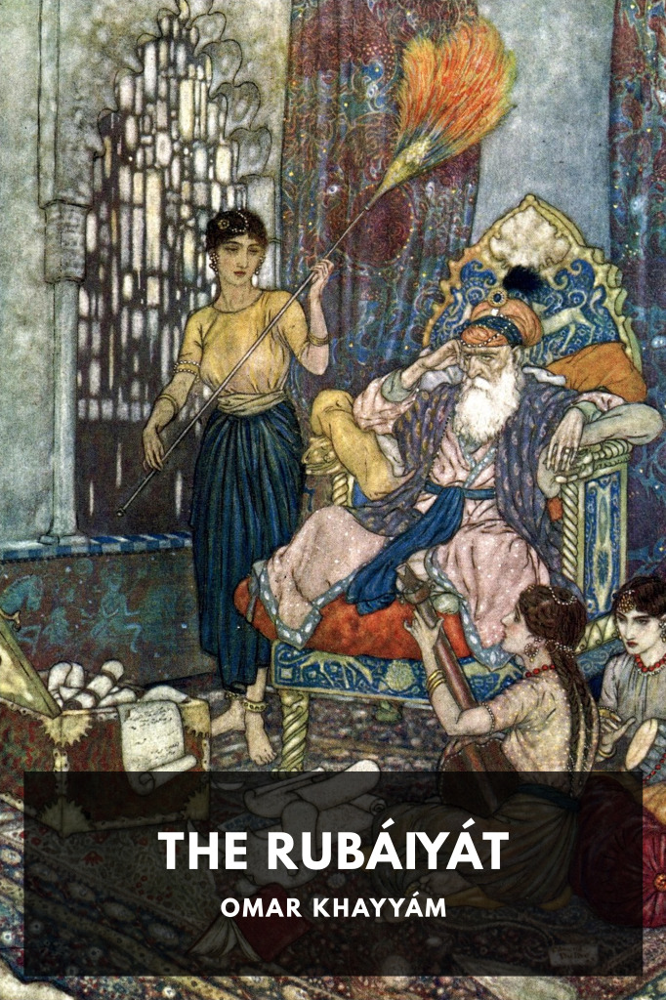

# The Rubáiyát of Omar Khayyám <kbd>v3.3.1</kbd>

  

## Creator
Omar Khayyám

## Description
Three volumes of lyrical quatrains about the joys of living, the meaning of existence, and what it means to lead a happy life.
