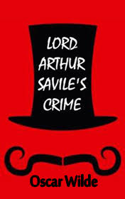

# Lord Arthur Savile's Crime <kbd>v3.2.1</kbd>

  

## Creator
Oscar Wilde

## Description
It is a satirical book about the Victorian era. The author elegantly mocks Victorian sense of duty and the aristocracy as a model of social morality. Lady Windermere has the last party at her estate before Easter. Lots of people from the aristocratic circles are invited. Mr. Podgers entertains the guests at the party. Being the personal chiromancer of Lady Windermere, he reads fortune on the palms of those who wish to learn their future. When Arthur Savile's turn comes, the chiromancer suddenly gets pale and pauses. Gradually he recovers and predicts a journey and death of one of the relatives. Lord Arthur Savile notices the embarrassment of the fortune teller. The lord demands the truth and proposes a considerable reward. The chiromancer tells the lord what he had really seen on his palm.
