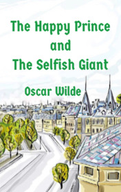

# The Happy Prince and the Selfish Giant <kbd>v3.2.1</kbd>

  

## Creator
Oscar Wilde

## Description
This book includes two stories written by the famous Irish author Oscar Wilde. Both tales are about kindness and self-sacrifice. The first story takes us to a big city. In the middle of the city, there is a statue of the Happy Prince. He is made of gold and decorated with some precious stones. He always looks happy. But in reality, he has a reason to be sad. The Prince asks a little Swallow for help. The Swallow faces a difficult choice, as his friends are waiting for him in Egypt. A Giant is the main character of the second story. He is the owner of a beautiful garden. The Giant is very selfish and he does not allow children to play near his house. That is why Spring never comes to his garden. Only one little boy manages to melt the Selfish Giant's heart and return beauty to the garden.
