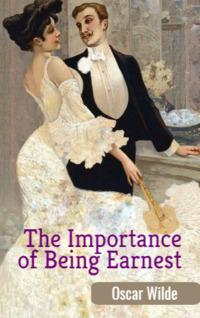

# The Importance of Being Earnest <kbd>v3.3.1</kbd>

  

## Creator
Oscar Wilde

## Description
The action of this comedy takes place in a large apartment in London and in a country estate. The reader meets a young man Algernon from an ancient aristocratic family. Now Algernon is sitting in the apartment and expecting his aunt, who is to come for tea soon. To kill time, he is talking with a footman named Lane. Both men are very fond of philosophizing without any reason. Suddenly his buddy Jack appears. This is a faithful opponent of Algernon in all disputes and endeavors, but at the same time a pleasant conversationalist. Both are tired of secular concerns and constant affairs. Algernon and Jack are extremely irresponsible egoists and like to accuse each other of infantility and frivolity. And these two gentlemen often gather together. 
