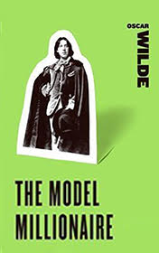

# The Model Millionaire <kbd>v3.3.1</kbd>

  

## Creator
Oscar Wilde

## Description
Hughie was a charming and handsome young man but quite poor. He inherited only 15 books and a sword from his father. This inheritance was more like a precious memory and nothing else. After Hughie had tried, in vain, numerous ways of honest ways to earn, he got despaired. There was even one more point to be so desperate тАУ the father of his beloved refused to give his approval for their marriage. What should Hughie do? The miserable man went to his painter friend... The Irish philosopher, esthete, writer and poet Oscar Wild wrote this masterpiece in 1887. Wilde's name is connected with the rebellion against Victorian morality with its substitution of bad for good and vice versa. His prose intended to offend the socially accepted tastes and conventions. In this story, the author expressed a kind of a protest against the dominance of practicality and the absolute common sense.
