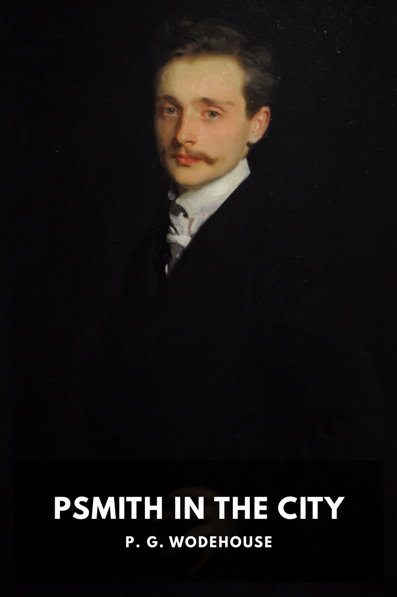

# Psmith in the City <kbd>v3.2.1</kbd>

  

## Creator
P. G. Wodehouse

## Description
A young man abandons his dream of playing cricket at Cambridge because of financial trouble and goes to work for a London bank, where he’s joined by an unflappable friend.
