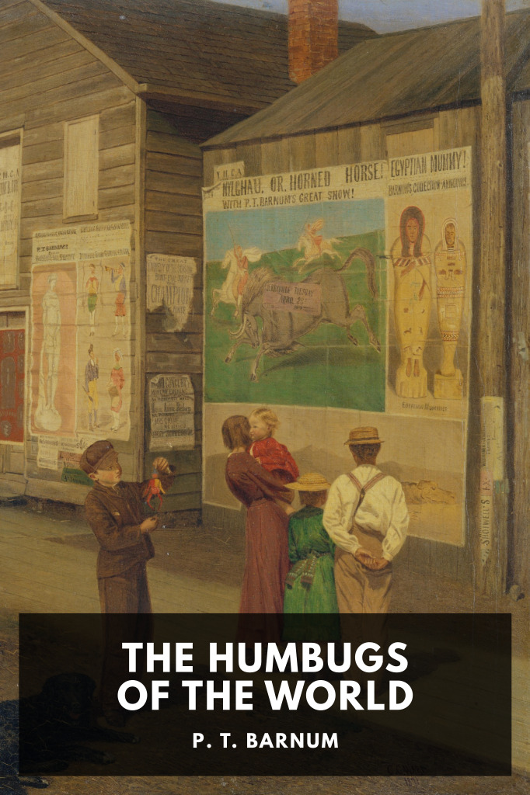

# The Humbugs of the World <kbd>v3.3.1</kbd>

  

## Creator
P. T. Barnum

## Description
American archetype and cultural founding father P. T. Barnum shares a collection of anecdotes that he deems “humbugs”—fodder for the gullible, deserving of skepticism—with the goal of making his fellow citizens a little wiser and more skeptical.
