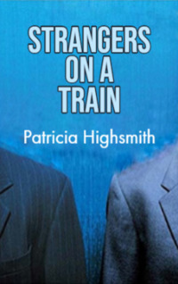

# Strangers on a Train <kbd>v3.3.1</kbd>

  

## Creator
Patricia Highsmith

## Description
'Strangers on a Train' is a dark psychological thriller. It explores human fear, madness and guilt. Guy Haines meets Charles Bruno on a train. This accidental meeting changes their lives forever. Guy is an architect who wants a divorce from his wife Miriam. Bruno is a rich but lazy young man who hates his father. He loves only money. Bruno says a strange thing. He can kill Miriam. But in exchange, Guy has to kill Bruno's father. Although the architect doesn't agree, Bruno commits this crime. Then he demands from Guy to keep his side of the bargain. Otherwise, he will tell everything to Guy's girlfriend Anne. Under such pressure Guy kills Bruno's father. Will he be able to live a normal life after this crime? 
