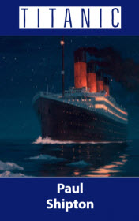

# Titanic <kbd>v3.2.1</kbd>

  

## Creator
Paul Shipton

## Description
Parents said goodbye to their children, wives kissed their husbands and friends shook hands with each other. They perfectly understood that they were seeing each other for the last time. The husband stayed on the ship but told his wife to get into the lifeboat. Titanic was not destined to return to the port from that voyage and many people died. But during this catastrophe many instances of courage and self-sacrifice were noticed. The night of April 14, 1912 is remembered by the whole world. The crew worked the whole night to save as many passengers as possible. But there were also such passengers who thought only of themselves and did not even try to help others. They pushed the women and children away to take their places in the lifeboats. People say that Titanic showed the real face of people - their best and worst sides.
