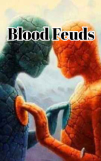

# Blood Feuds <kbd>v3.3.1</kbd>

  

## Creator
Paul Tiyambe Zeleza

## Description
Correted version	The one who has never felt like this will not be able to understand the whole pain of the person who was expelled from his home. How does it feel to live in a foreign country and speak a foreign language? You are always a foreigner, in any situation. Two families have been living in Zimbabwe for almost thirty years. Their home country is called Malawi, but they cannot come back there. They believed that one day they would return home. Although the men from these families have disagreements, they try to stick together. After all, they are countrymen. They often talked about the house. About the time when they were children: how they grew up, what games they played in their childhood. They remembered their schools and the beginning of the struggle for freedom against the British.
