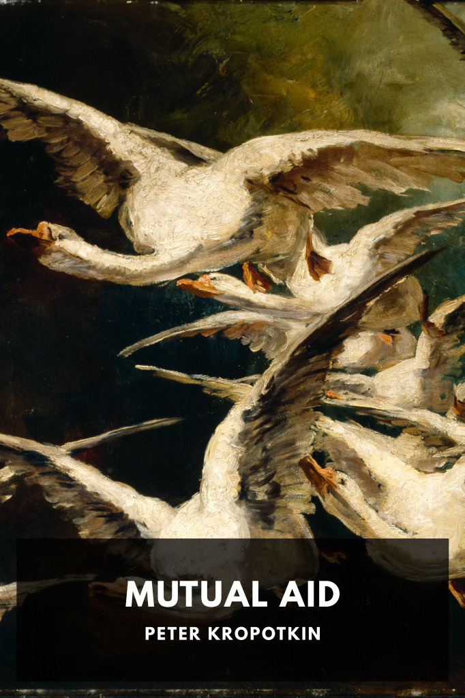

# Mutual Aid <kbd>v3.2.1</kbd>

  

## Creator
Peter Kropotkin

## Description
Kropotkin explores the role of cooperation in animal societes and human societies, past and present, and how it could benefit modern society.
