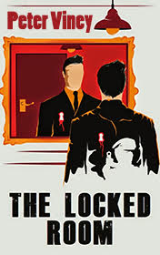

# The Locked Room <kbd>v3.2.1</kbd>

  

## Creator
Peter Viney

## Description
The man wakes up in an unfamiliar beautiful room and cannot get where he is and who he is. He is alone on the bed in an empty room with the expensive pieces of furniture. His head is hurting, he is very thirsty, but he is too weak to ask for help and falls asleep. Next time he is awake, another man comes in a black classic suit with a glass of water and a gun. He starts asking questions the man on the bed - who he is and what he was doing. The man with the gun hits the prisoner every time he does not get the answers. However, little by little the memory starts to return. Pieces by pieces the injured man is beginning to remember what had happened before he was hit in the back of his head. Then he hears voices out the door that say they need answers in two days orтАж the man doesn't want to think what will be then...
